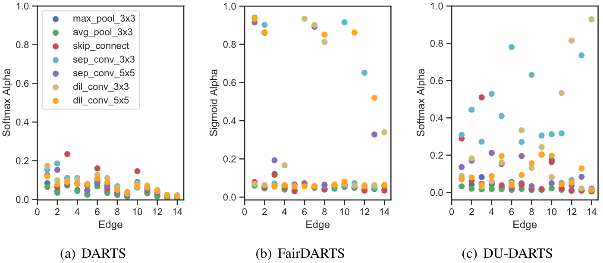

# DU-DARTS: Decreasing the Uncertainty of Differentiable Architecture Search
Pytorch Implementation for "DU-DARTS: Decreasing the Uncertainty of Differentiable Architecture Search
". Code will be released soon.


## Citation
```
@inproceedings{lu2021dudarts,
        title={DU-DARTS: Decreasing the Uncertainty of Differentiable Architecture Search},
        author={Lu, Shun and Hu, Yu and Yang, Longxing and Sun, Zihao and Mei, Jilin and Zeng Yiming and Li, Xiaowei },
        booktitle={BMVC},
        year={2021}
}
```

